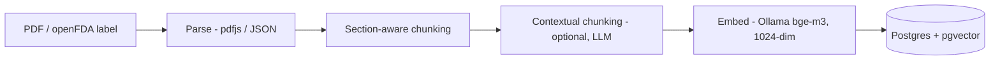
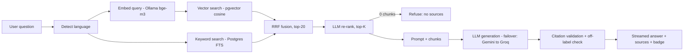
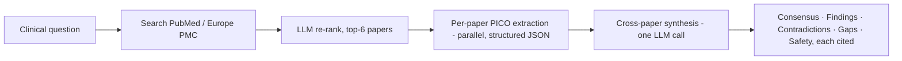

# PharmIQ — Pharma Vertical RAG

> A bilingual (TR/EN), citation-grounded Retrieval-Augmented Generation system for pharmaceutical drug information — built for **MLR-style faithfulness**: every answer is grounded in retrieved source documents, citations are validated, and the model refuses to answer when no sources support the question.

Production-style RAG over real **openFDA drug labels**: hybrid retrieval (vector + full-text) with reciprocal-rank fusion, LLM re-ranking, **validated `[^N]` citations**, an off-label safety check, a **RAGAS-style evaluation harness**, and a **multi-provider LLM layer with automatic failover** — running fully on a **free/local stack** (local embeddings via Ollama, free LLM tiers).

---

## Why this project

In pharma, an answer that *sounds* right but isn't traceable to an approved source is worse than no answer (Medical-Legal-Regulatory risk). PharmIQ is engineered around that constraint:

- **Grounded only in retrieved sources** — closed-corpus; no open-web answering.
- **Citations are validated, not trusted** — generated `[^N]` footnotes are checked against the actual retrieved chunks (range + coverage); hallucinated/out-of-range citations are flagged.
- **Refuses on no evidence** — a 0-chunk guard returns a fixed "no sources" response instead of calling the LLM (hallucination becomes impossible).
- **Verbatim provenance** — stored chunk text stays byte-for-byte from the source; contextual augmentation only sharpens the embedding, never the cited text.

## Features

- **Hybrid retrieval + RRF** — pgvector cosine (semantic) + Postgres full-text (lexical), fused with Reciprocal Rank Fusion (k=60) → scale-independent ranking.
- **LLM re-ranking** — top-20 candidates re-ordered by an LLM (listwise) → top-K most relevant; graceful fallback to RRF order.
- **Contextual chunking** — optional LLM-generated 1-sentence context prepended *only to the embedding* (Anthropic "Contextual Retrieval" pattern).
- **Citation validation** — `lib/llm/citations.ts`: parses `[^N]`, validates range, computes sentence coverage; surfaced as a UI badge (✓ verified / ⚠ invalid).
- **Off-label detection** — flags answers that may require MLR approval.
- **Multi-provider failover** — Gemini → Groq → GitHub Models; if one provider hits a quota/error, generation automatically continues on the next.
- **RAGAS-style evaluation** — faithfulness, answer relevancy, context precision via an LLM judge, against a golden question set.
- **Live literature search** — query PubMed/MEDLINE in real time via the Europe PMC REST API; answers cite real papers (PMID/DOI), not just the local corpus.
- **Evidence synthesis (Consensus/Elicit-style)** — for a clinical question, PharmIQ extracts structured **PICO** evidence per paper (study type, sample size, key finding, quality flags), then synthesizes across papers into **consensus level · key findings · contradictions · evidence gaps · safety notes**, every claim `[^N]`-cited.
- **Bilingual** — Turkish + English (next-intl), language-aware prompts and retrieval.

### Three answering modes

| Mode | Source | Output |
|---|---|---|
| **Documents** | Uploaded labels (hybrid retrieval over the local corpus) | Grounded Q&A with validated citations |
| **Literature** | Live PubMed / Europe PMC | Q&A grounded in real papers (PMID/DOI) |
| **Synthesis** | Live PubMed → per-paper PICO extraction → cross-paper synthesis | Evidence review: consensus / contradictions / gaps |

## Architecture

**Ingestion pipeline**



**Query pipeline**



**Synthesis pipeline** (literature mode → evidence review)



## Evaluation

RAGAS-style metrics (LLM-as-judge) over a 10-question golden set, on the openFDA corpus (15 drugs, 139 chunks):

| Metric | Score (n=10) |
|---|---|
| Faithfulness | **0.785** |
| Answer relevancy | **0.90** |
| Context precision | **0.36** |

**Reading the results honestly (this is the point of having an eval):**
- **Answer relevancy 0.90** — answers address the questions well.
- **Faithfulness 0.785** — answers are mostly grounded; swapping the ad-hoc demo doc for the real openFDA corpus raised this from 0.55 → 0.785.
- **Context precision 0.36 is low — and the eval told us why:** most single-drug questions have only 1–2 truly relevant chunks in the corpus, but rerank returned 6 → the rest are distractors. Lowering `rerank topK` (6 → 4) raised per-item precision toward 0.80 on the questions measured before the free-tier daily LLM quota was exhausted; a clean topK=4 re-measure is pending quota reset.

**Methodology note:** this is a TS-native implementation of the RAGAS metrics (LLM-as-judge), not the official Python `ragas` library — chosen to keep the eval inside the app stack and the metric logic legible. Run with `pnpm eval`.

## Tech stack

| Layer | Choice |
|---|---|
| App / API | Next.js 15 (App Router, TypeScript), Vercel AI SDK 6 (streaming) |
| Database | PostgreSQL + pgvector |
| ORM | Drizzle |
| Embeddings | **Ollama `bge-m3`** (local, free, 1024-dim) |
| Generation | Gemini 3 Flash · Groq (Llama 3.3 70B) · GitHub Models — with failover |
| Parsing | pdfjs-dist |
| i18n / UI | next-intl (TR/EN), Tailwind, shadcn/ui |
| Corpus | openFDA drug labeling (CC0 public domain) |

## Run locally

Prerequisites: Node 20+, pnpm, Docker, and [Ollama](https://ollama.com) with `bge-m3`.

```bash
# 0. Embedding model (local, free)
ollama pull bge-m3

# 1. Install
pnpm install

# 2. Postgres + pgvector (Docker) and schema
pnpm db:up        # or: docker start pharmiq-postgres
pnpm db:migrate

# 3. Env — copy and fill keys (GROQ_API_KEY and/or GOOGLE_AI_API_KEY)
cp apps/web/.env.example apps/web/.env.local

# 4. Seed tenant + load the corpus from openFDA
pnpm seed
pnpm load:openfda

# 5. Run
pnpm dev          # http://localhost:3000/tr/chat

# Evaluate
pnpm eval         # -> apps/web/eval/results.json
```

## Engineering decisions / trade-offs

- **pgvector over a dedicated vector DB (Qdrant/Pinecone):** one datastore for documents + vectors + full-text → simpler ops, transactional, easy hybrid search. Trade-off: less specialised ANN tuning at very large scale.
- **RRF over weighted score fusion:** vector cosine and FTS rank live on different scales; RRF fuses *ranks*, so it needs no per-source weight tuning and is robust.
- **Local embeddings (Ollama bge-m3):** free, unlimited, offline, and 1024-dim matches the schema — removes the embedding load from rate-limited LLM APIs entirely.
- **Multi-provider failover:** free LLM tiers have different limit shapes (Groq = daily token cap; Gemini = per-minute burst). Chaining them keeps the app working when any single provider is throttled.
- **Citation faithfulness = verbatim storage:** the cited chunk text is stored exactly as in the source; contextual augmentation is added to the embedding text only. In a regulated domain, the cited text must be traceable byte-for-byte.
- **LLM re-ranking (pragmatic) vs cross-encoder (production):** a listwise LLM re-ranker needs no extra model to host; a dedicated cross-encoder (or a fine-tuned small reranker) is the production upgrade.

## Roadmap / production upgrades

- **Evidence comparison table** — render the per-paper PICO already extracted in synthesis mode as a sortable matrix (study type · sample size · key finding · quality), à la Elicit.
- **Exportable evidence report** — one-click PDF/DOCX of a synthesis (summary · consensus · findings · contradictions · references) for Medical Affairs hand-off.
- Clean topK=4 re-measure; expand the corpus and golden set; publish the eval set as a Hugging Face dataset.
- Cross-encoder / fine-tuned reranker; Cohere/managed embeddings for hosted deployment.
- Deploy (Vercel + managed Postgres + hosted embedding); request/trace monitoring; CI eval gate.
- Turkish-language corpus from TİTCK KÜB/KT (currently English/openFDA — see `docs/eval-veri-kaynaklari.md`).

## Data & license

Corpus: **openFDA** drug labeling — U.S. public domain (CC0). This repository is a **portfolio / educational project**.
© 2026 Görkem Melih Özcan.

## Author

**Görkem Melih Özcan** — Software Engineering (Beykent Univ.), focused on ML / Computer Vision / LLM-RAG.
GitHub [@gorkemelih](https://github.com/gorkemelih) · LinkedIn [gorkemmelihozcan](https://linkedin.com/in/gorkemmelihozcan) · Kaggle [melihozcan](https://kaggle.com/melihozcan)
